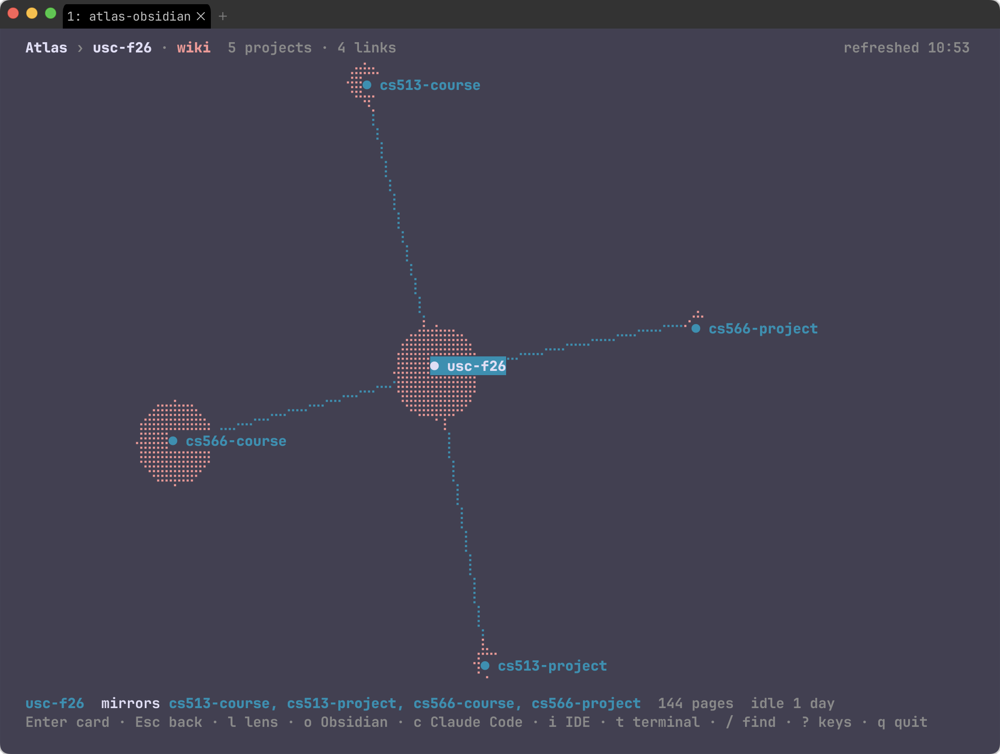
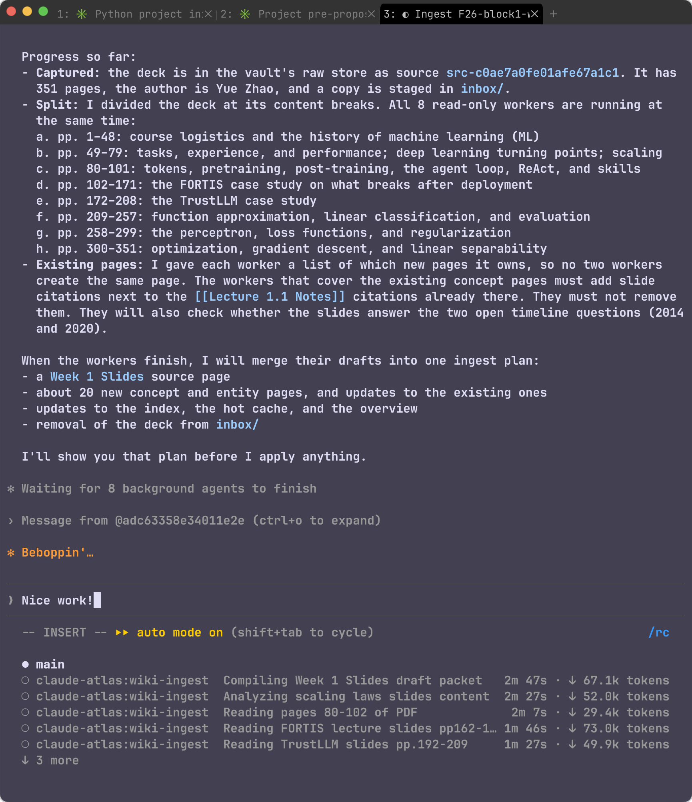
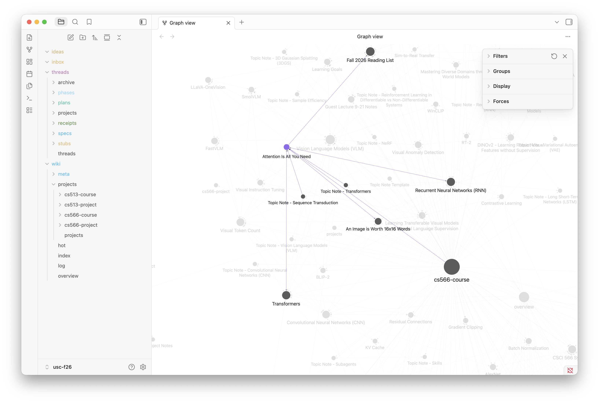
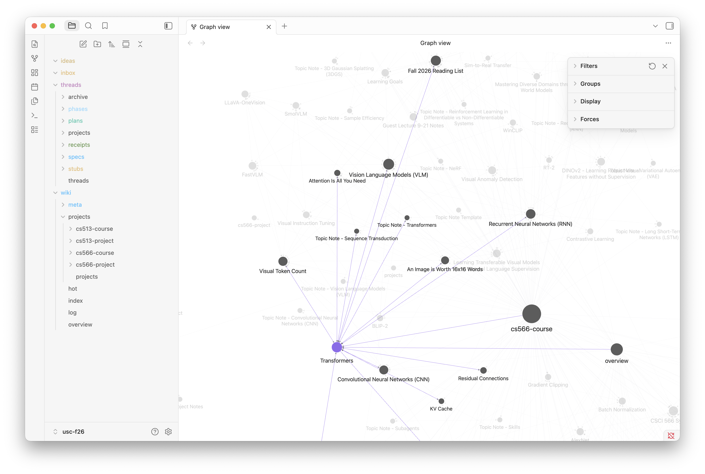
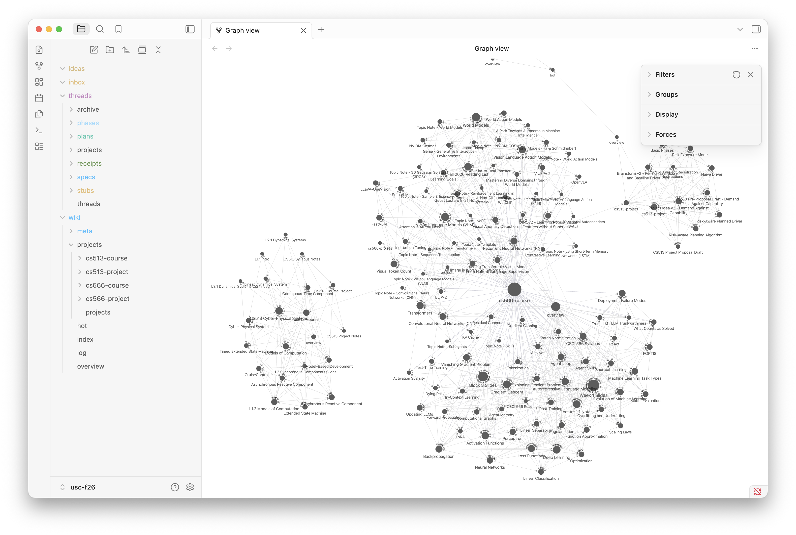

# atlas-obsidian

A wiki and the state of the work, in every project.

[](LICENSE)
[](go.mod)
[](.claude-plugin/plugin.json)
[](.codex-plugin/plugin.json)
[](.claude-plugin/plugin.json)

## About

Every agent session starts blank. You explain the project again, the agent reads
the same code to reach the same conclusion it reached last week, and the context
window closes on all of it.

atlas-obsidian keeps what a project knows inside the project: Markdown pages that
git tracks and Obsidian opens, in a folder beside your code. Start Claude Code or
Codex anywhere in the repository and the session opens already knowing what the
project is, what the wiki learned recently, which threads are open, and what is
waiting to be read.



*`atlas-obsidian` with no arguments: every project it knows, the links between
them, and a disk that grows with the size of each wiki.*

Two pieces install separately: a Go binary that makes a folder of work into a
project and serves its MCP tools, and a plugin for Claude Code and Codex that
carries the skills and hooks. Both agents read the same files, with no conversion
between them.

## What a project holds

One folder, `atlas/<name>/`, sitting beside your code.

```
webapp/                      your repository
├── ...                      your work, untouched
└── atlas/
    └── webapp/
        ├── project.json     name, description, filing mode, threads on or off
        ├── wiki/            the pages, and the log of every change to them
        ├── threads/         stubs, specs, plans, receipts; optional
        ├── inbox/           what you drop in: sources, and notes
        └── ideas/           your scratch notes, which nothing reads
```

It holds two things.

**A wiki that cites its sources.** Put a PDF, an article, or a note in `inbox/`.
The agent reads it, keeps an unmodified copy under `.raw/captured/`, and writes
pages that cite that copy. Ask a question later and the answer names the page and
the source behind it.

**Threads that carry the work.** A thread is one bug, feature, or chore, and it
moves through four documents: a stub in your own words, then a spec, a plan, and
a receipt. Nothing records which stage a thread is in. The furthest document that
exists *is* the stage, so every change of state is a page you can open and read.

### Large sources, read in parallel, written once



A 351-page slide deck does not fit in one context window. `wiki-ingest` splits it
at its content breaks and sends each range to a read-only worker, eight at a
time. A worker reads only its range and returns the claims it found, each with
the page it came from; it writes nothing. The session groups those claims by
subject, drops the repetitions, keeps every locator, and turns the result into
one plan you see before a single file changes.

### Pages link to what taught them

Ingestion writes ordinary wikilinks, so the wiki is a graph you can walk in
either direction: from a paper to the concepts it introduced, and from a concept
back to every source that covers it.

| Hovering a source page | Hovering a concept page |
|---|---|
|  |  |

### One wiki over several projects

A project may list other projects as members. Its wiki then mirrors each member's
wiki under `wiki/projects/<name>/`, and its own pages link into those mirrors
with ordinary wikilinks. Obsidian shows one graph over the whole ecosystem, and a
session in the hub reads one wiki.



```bash
atlas-obsidian edit platform --add-member svc-a --add-member svc-b
atlas-obsidian sync platform
```

The mirrors are derived: sync rewrites them as one operation, the guard refuses
edits there, and a member never knows it is listed. The members' threads come
along too, so the hub's board shows every open thread in the ecosystem. When two
members wrote about one thing, `overlap` finds the pair and `atlas-merge`
proposes the page that replaces both. Design and reasons:
[docs/members-design.md](docs/members-design.md).

## Quickstart

### Prerequisites

- [Claude Code](https://claude.com/claude-code) or
  [Codex CLI](https://learn.chatgpt.com/docs/cli), with `claude` or `codex` on
  your PATH. Codex needs a release with `codex plugin` and `/hooks` support.
- git, and Go 1.24 or newer to build the binary.
- macOS or Linux.
- [Obsidian](https://obsidian.md) is optional. The files are plain Markdown and
  read fine anywhere, but the folder is laid out for it and ships a CSS snippet
  that colors each kind of folder.

### Install

```bash
git clone https://github.com/nathanaday/atlas-obsidian.git
cd atlas-obsidian
make install

atlas-obsidian setup --agent claude --plugin-source "$PWD"   # or --agent codex
```

`make install` puts `atlas-obsidian` in `$(go env GOPATH)/bin`, usually
`~/go/bin`; add that to your PATH if it is not there. Use `make install` rather
than `go install` so the binary carries its version, which lets
`atlas-obsidian doctor` tell you when the binary and the plugin have drifted
apart.

Setup prints what it intends to do and waits for you to agree. Run it once per
agent if you use both. Codex users then open `/hooks` in a new session, trust the
Atlas hooks, and restart; Codex skips hooks until they are trusted. Check the
result with `atlas-obsidian doctor --agent claude` or `--agent codex`.

### Make a project

```bash
cd ~/code/webapp
atlas-obsidian init --description "The customer-facing web app."
```

This writes `atlas/webapp/` beside your code, commits it, and records the folder
in the atlas config. A folder that is not in a git repository becomes one, since
the wiki needs a history to commit into; pass `--no-git` to decline.

Two filing modes decide where a new page lands. `generic`, the default, files by
type into `wiki/sources/`, `wiki/entities/`, and `wiki/concepts/`. `lyt` keeps
atomic notes in `wiki/notes/` and navigates them through Maps of Content in
`wiki/mocs/`. Switch with `atlas-obsidian edit webapp --mode lyt`; pages already
written stay where they are.

For a repository with history, run `/atlas-obsidian:atlas-onboard` in a session
instead. It makes the project, describes the work in the wiki, proposes a
structure, and turns the TODO and FIXME lines, roadmap notes, and open issues it
finds into threads you pick from.

## Usage

Open a thread and start a session on it:

```bash
atlas-obsidian thread webapp new "Filter vehicle false alarms" --priority high
claude   # or: codex
```

Teach the wiki something:

```bash
cp ~/Downloads/paper.pdf ~/code/webapp/atlas/webapp/inbox/
claude   # or: codex
```

Then choose a skill. Every skill is a verb on one of three nouns, so the name
says where it belongs: `atlas-` for projects, `wiki-` for what a project knows,
`thread-` for what it does. In Codex, type `$` and pick from the list.

| Claude Code | Codex | What it does |
|---|---|---|
| `/atlas-obsidian:atlas` | `$atlas` | every project, and the map of every skill |
| `/atlas-obsidian:thread-work` | `$thread-work` | carries a thread on: spec, plan, the work, the receipt |
| `/atlas-obsidian:wiki-ingest` | `$wiki-ingest` | turns the sources in the inbox into cited pages |
| `/atlas-obsidian:wiki-query` | `$wiki-query` | answers from the wiki, changing nothing |
| `/atlas-obsidian:wiki-review` | `$wiki-review` | checks the wiki, quick or deep |

`/atlas-obsidian:thread-work Filter vehicle false alarms` writes that thread's
spec and stops for your yes, then the plan, then does the work. All 21 skills and
how they fit: [docs/skills.md](docs/skills.md).

Run `atlas-obsidian` with no arguments for the view above: every project as a
node, every member link as an edge, laid out by a live force simulation. `l`
changes the lens — wiki, threads, or version control — and from any node `o`
opens Obsidian, `c` starts your agent there, `i` opens your IDE, and `t` opens a
terminal.

Every command and its options: [docs/usage.md](docs/usage.md).

## Patterns and conventions

Full reasoning in [docs/core-design.md](docs/core-design.md).

- **One operation, one commit.** A hook refuses the agent's file-edit tools
  anywhere under `wiki/`. The agent prepares a plan instead; you see what it
  creates, replaces, and deletes, and approving it makes one git commit.
  `atlas-obsidian undo` takes that commit back by restoring the files it touched,
  and refuses if you have changed one of them since.
- **The folder is yours.** Anything you typed in Obsidian is committed first, as
  its own operation, so an undo can never reach your edits. Every git command an
  operation runs is limited to `wiki/`, `.raw/`, `inbox/`, and `project.json`, so
  an apply never stages your source code.
- **Code owns what code can derive.** The wiki's log, the ledger of sources, the
  thread cards, the board that lists them, and the opening callout of each thread
  document are all written by the binary. The agent writes the prose.
- **Ids travel; paths stay.** A project's `project.json` holds no path. The paths
  live in `~/.atlas-obsidian/config.json`, and the atlas never searches your disk
  — it knows about a project because `init` added its folder to that list. Move
  the folder and the next session started inside it repairs the entry.

## Documentation

- Every command and its options — [docs/usage.md](docs/usage.md)
- How the engine works and why — [docs/core-design.md](docs/core-design.md)
- The layout of a project — [docs/v4-design.md](docs/v4-design.md)
- How threads work — [docs/threads-design.md](docs/threads-design.md)
- The skills, how they fit, and what each owns — [docs/skills.md](docs/skills.md)
- One wiki over several projects — [docs/members-design.md](docs/members-design.md)

External: [Obsidian](https://obsidian.md) ·
[Claude Code plugins](https://code.claude.com/docs/en/plugins) ·
[Codex plugin packaging](https://developers.openai.com/plugins/build/plugins) ·
[MCP Go SDK](https://github.com/modelcontextprotocol/go-sdk)

## Credits

The vault layout, the inbox workflow, and the skills derive from
[claude-obsidian](https://github.com/AgriciDaniel/claude-obsidian) by
AgriciDaniel (MIT), which follows
[Andrej Karpathy's LLM Wiki pattern](https://gist.github.com/karpathy/442a6bf555914893e9891c11519de94f).
Obsidian syntax references draw on
[kepano/obsidian-skills](https://github.com/kepano/obsidian-skills).
atlas-obsidian is released under the [MIT License](LICENSE).
