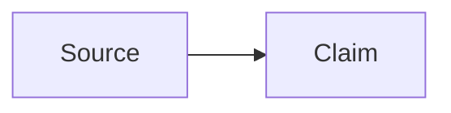

# Obsidian Flavored Markdown

A compact fallback for Obsidian-specific syntax. Prefer a separately installed
`kepano/obsidian-skills` `obsidian-markdown` skill when available, then
[Obsidian Help](https://help.obsidian.md/), for detailed or version-sensitive
questions.

Answer syntax questions read-only. If the user asks for a vault edit, draft the
complete page, then build one plan of kind `markdown` with only `wiki/` targets
as [operations.md](../wiki/references/operations.md) describes. A new canonical
page also joins the index or a MOC in that plan. Never write a page directly.

## Properties

Use flat YAML properties and `YYYY-MM-DD` dates. Quote wikilinks inside YAML.

```yaml
---
type: concept
title: "Contextual Retrieval"
created: 2026-09-12
updated: 2026-09-12
status: developing
tags:
  - retrieval
  - ai/knowledge
aliases:
  - Context-aware retrieval
related:
  - "[[Retrieval]]"
sources:
  - "[[Anthropic Contextual Retrieval]]"
---
```

Do not nest objects in generated properties. Use block lists rather than inline
arrays. Quote numeric-only tag values, for example `- "2026"`. Keep unknown
existing properties unless the requested edit changes them.

## Wikilinks and embeds

```markdown
[[Note Name]]
[[Note Name|Display text]]
[[Note Name#Heading]]
[[Note Name#^block-id]]
[[Folder/Note Name]]

This paragraph is addressable. ^evidence-block

![[Note Name#Summary]]
![[diagram.png|480]]
![[paper.pdf#page=3]]
```

Match the target file name exactly. Use a folder-qualified path when a basename
is ambiguous. Use standard Markdown links for external URLs and wikilinks for
this vault's pages.

## Callouts

```markdown
> [!note]
> Supporting context.

> [!warning] Review required
> This claim has contradictory evidence.

> [!question]- Open question
> What evidence would resolve this?
```

`-` starts collapsed and `+` starts expanded. Built-in types include `note`,
`abstract`, `info`, `todo`, `tip`, `success`, `question`, `warning`, `failure`,
`danger`, `bug`, `example`, and `quote`. Preserve custom callout types.

## Other syntax

````markdown
#inline-tag #nested/tag

==Highlighted text==

Visible text %%hidden comment%%

Inline math: $E = mc^2$

$$
\int_0^1 x^2\,dx = \frac{1}{3}
$$


````

Standard CommonMark and GFM headings, lists, tasks, tables, code fences, and
footnotes remain valid. Avoid HTML when native Markdown is enough.

## Validate a draft

- The YAML block parses and property types are consistent.
- Every internal target, heading, and block reference resolves; the `plan`
  preview warns about those that do not. Never fabricate a target.
- Evidence wording stays distinct from inference; source locators survive.
- Code fences and callout quoting are balanced.
- After an applied edit, run `wiki-lint` and report remaining findings without
  repairing them unasked.
