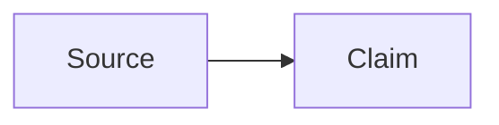

# Obsidian syntax

Read this before you write a wiki page. It covers what Obsidian adds to
Markdown and the callouts this vault defines. For a detail it does not cover,
or one that changes between Obsidian versions, see
[Obsidian Help](https://help.obsidian.md/). Page properties are in
[frontmatter.md](frontmatter.md).

## Properties

Use flat YAML properties and `YYYY-MM-DD` dates. Quote wikilinks inside YAML.

```yaml
---
type: concept
title: "Contextual Retrieval"
created: 2026-09-12
updated: 2026-09-12
status: developing
tags:
  - retrieval
  - ai/knowledge
aliases:
  - Context-aware retrieval
related:
  - "[[Retrieval]]"
sources:
  - "[[Anthropic Contextual Retrieval]]"
---
```

Do not nest objects in generated properties. Use block lists rather than inline
arrays. Quote numeric-only tag values, for example `- "2026"`. Keep unknown
existing properties unless the requested edit changes them.

## Wikilinks and embeds

```markdown
[[Note Name]]
[[Note Name|Display text]]
[[Note Name#Heading]]
[[Note Name#^block-id]]
[[Folder/Note Name]]

This paragraph is addressable. ^evidence-block

![[Note Name#Summary]]
![[diagram.png|480]]
![[paper.pdf#page=3]]
```

Match the target file name exactly. Use a folder-qualified path when a basename
is ambiguous. Use standard Markdown links for external URLs and wikilinks for
this vault's pages.

## Callouts

```markdown
> [!note]
> Supporting context.

> [!warning] Review required
> This claim has contradictory evidence.

> [!question]- Open question
> What evidence would resolve this?
```

`-` starts collapsed and `+` starts expanded. Built-in types include `note`,
`abstract`, `info`, `todo`, `tip`, `success`, `question`, `warning`, `failure`,
`danger`, `bug`, `example`, and `quote`. Keep a callout type you find on a page.

The vault's snippet defines four callouts for the states of knowledge. Use
them on wiki pages, sparingly; `wiki-review` looks for them.

| Callout | Marks |
|---|---|
| `contradiction` | two pages or two sources that disagree; name both |
| `gap` | a subject the wiki has no source for yet |
| `key-insight` | the one takeaway of a section |
| `stale` | a claim that may be out of date; say why |

```markdown
> [!contradiction] Two release dates
> [[Release notes]] gives 2026-03-01; [[Roadmap]] gives 2026-04-01.
```

The thread stages have callouts of their own (`stub`, `spec`, `plan`,
`receipt`, `killed`, `phase`). Code writes those; do not use them on a wiki
page.

## Other syntax

````markdown
#inline-tag #nested/tag

==Highlighted text==

Visible text %%hidden comment%%

Inline math: $E = mc^2$

$$
\int_0^1 x^2\,dx = \frac{1}{3}
$$


````

Standard CommonMark and GFM headings, lists, tasks, tables, code fences, and
footnotes remain valid. Avoid HTML when native Markdown is enough.

## Validate a draft

- The YAML block parses and property types are consistent.
- Every internal target, heading, and block reference resolves; the `plan`
  preview warns about those that do not. Never fabricate a target.
- Evidence wording stays distinct from inference; source locators survive.
- Code fences and callout quoting are balanced.
- The `plan` preview's warnings are the check after drafting; `wiki-review`
  is the check across the whole wiki.
